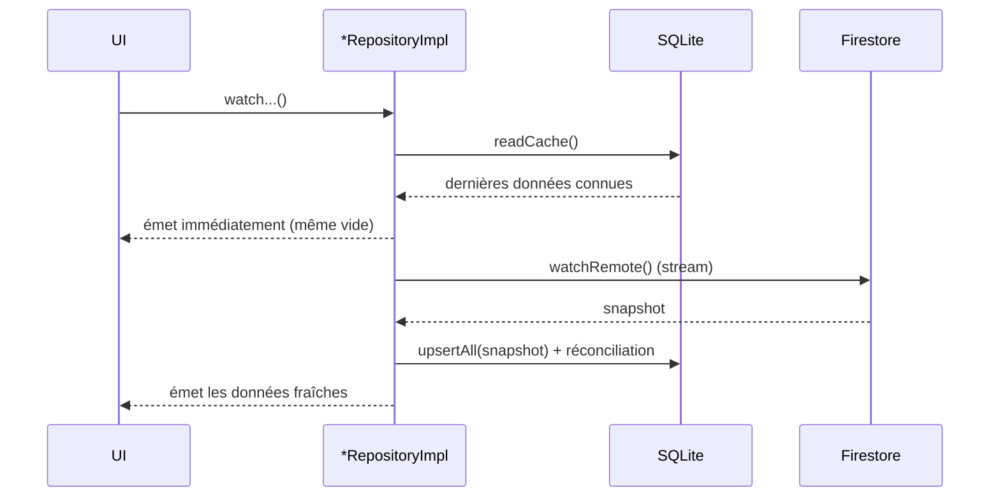
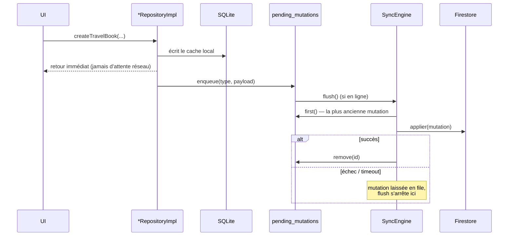

# Hors ligne et synchronisation

TravelStories fonctionne sans connexion pour tout ce qui concerne les données de l'utilisateur (ses carnets, ses expériences) : lecture, création, édition, publication, suppression — tout répond **instantanément**, en ligne ou non, puis se synchronise avec Firestore dès que la connexion revient.

## Vue d'ensemble

Deux mécanismes complémentaires, tous deux dans `lib/core/` (aucun ne connaît le domaine métier) :

1. **`localFirstStream` / `localFirstSingleStream`** (`lib/core/offline/local_first_stream.dart`) — pour les **lectures** : sert le cache local immédiatement, puis bascule sur le flux Firestore en direct.
2. **`SyncEngine`** (`lib/core/sync/`) — pour les **écritures** : applique la mutation au cache local tout de suite, l'enregistre dans une file persistante, et la rejoue contre Firestore dès que possible.

Le cache local est une base **SQLite** (`sqflite`), schéma dans `lib/core/database/app_database.dart` : une table `travel_books`, une table `experiences` (miroir des entités Firestore, snake_case), et une table `pending_mutations` (la file d'écritures en attente).

## Lecture : cache immédiat, puis flux distant

Si `watchRemote()` échoue (typiquement : pas de connexion) **après** qu'un cache non vide a déjà été émis, l'erreur est avalée : l'UI garde simplement le dernier état connu plutôt que de basculer sur un écran d'erreur. Elle n'est propagée que s'il n'y avait rien à afficher en repli.

Chaque snapshot Firestore frais est mirroré dans SQLite, puis réconcilié : les lignes locales qui ne sont plus dans le snapshot (supprimées côté serveur pendant que l'appareil était hors ligne) sont effacées localement.

> **Hors périmètre** : le flux public (Accueil/Explorer, `fetchPublicTravelBooks`) reste 100% Firestore, sans cache local — parcourir les carnets d'autres utilisateurs hors ligne n'est pas le cas d'usage central de l'app.

## Écriture : optimiste locale, puis file de mutations

Chaque méthode d'écriture d'un repository (`create*`/`update*`/`publish*`/`delete*`) :
1. Applique le changement au cache SQLite immédiatement.
2. Retourne à l'appelant sans attendre Firestore.
3. Appelle `SyncEngine.enqueue(type, payload)`.

Une méthode privée `_applyXxx`, enregistrée via `registerApplier(type, fn)` dans le constructeur du repository, rejoue la vraie écriture Firestore quand `SyncEngine` traite la mutation.

### Garanties de `SyncEngine`

- **Ordre strict, FIFO** : `pending_mutations.id` est un entier auto-incrémenté, donc `ORDER BY id ASC` suffit à rejouer les mutations dans l'ordre où elles ont été faites. Un `flush()` **s'arrête à la première mutation qui échoue** plutôt que de sauter les suivantes — une écriture plus récente sur la même entité ne doit jamais atteindre Firestore avant une plus ancienne.
- **Un seul passage réel à la fois** : les appels concurrents à `flush()` partagent le même `Future` en cours (`_inFlightFlush`) plutôt que de déclencher plusieurs passages ou de retourner immédiatement sans rien faire — un `await engine.flush()` attend fiablement que tout passage en cours soit terminé, même déclenché ailleurs (ex. par `enqueue()`).
- **Déclenchement automatique** : `SyncEngine.start()` écoute `ConnectivityService.onStatusChanged`, qui rapporte l'état courant dès l'abonnement — couvre aussi bien "la connexion vient de revenir" que "l'app redémarre déjà en ligne avec des mutations laissées en attente".
- **Timeout par mutation** (15s par défaut) : `connectivity_plus` ne vérifie que l'état de l'interface réseau, pas la joignabilité réelle de Firestore ; un timeout évite qu'une fausse détection "en ligne" ne bloque la file indéfiniment.
- **Mutation sans applier enregistré** : abandonnée (retirée de la file) plutôt que de bloquer tout ce qui suit — ne devrait pas arriver en pratique (chaque type de mutation a son applier enregistré au démarrage).

### Ce qui n'est **pas** couvert

- **Résolution de conflits multi-appareils.** La stratégie est "dernière écriture locale gagne" par construction : une seule file par appareil, rejouée dans l'ordre. Si deux appareils du même utilisateur modifient le même carnet hors ligne en parallèle, il n'y a ni détection ni fusion.
- **Médias.** `uploadCover`/`uploadMedia`/`removeMedia` ne passent jamais par la file de mutations — toujours un appel direct et synchrone vers le stockage (local aujourd'hui, voir plus bas). Mettre en file un upload hors ligne différé (persister les octets, gérer une reprise) est un problème sensiblement différent, non traité — de toute façon sans objet tant que le stockage est local (une écriture disque ne dépend pas de la connectivité).
- **IDs générés côté client.** `createTravelBook`/`createExperience` appellent `collection.doc().id` (synchrone) plutôt que `collection.add(data)`, précisément pour permettre une création hors ligne — sans ça, il faudrait un aller-retour réseau pour connaître l'ID avant même de pouvoir écrire le cache local. Conséquence : `createdAt` est un timestamp posé côté client, pas `serverTimestamp()`, pour rester identique entre le cache local et l'écriture Firestore différée.

## Connectivité et retour visuel

`ConnectivityService` (interface) / `ConnectivityPlusService` (implémentation réelle, `connectivity_plus`) exposent `isOnlineProvider`, qui pilote `OfflineBanner` — un bandeau affiché au-dessus des onglets ("Vous êtes hors ligne" / "Connexion rétablie") dans `AppShell`. `connectivity_plus` ne vérifie que l'état de l'interface réseau (Wi-Fi/données activées), pas la joignabilité réelle d'Internet — suffisant pour décider si Firestore a une chance de répondre, pas un vrai ping de reachability.

> Le bandeau n'est pas raccordé à l'état réel de la file d'attente (nombre de mutations en attente) — amélioration possible mais non nécessaire au fonctionnement du moteur.

## Médias — stockage local en attendant Storage

Firebase Storage n'est pas activé (plan Blaze indisponible, voir [DEPLOYMENT.md](DEPLOYMENT.md)). En attendant, **tous les médias (avatar, couverture de carnet, photo/vidéo d'expérience) sont écrits directement sur le disque de l'appareil**, à la demande explicite de l'utilisateur — pas de file d'attente ni de synchronisation impliquée, une écriture disque ne dépend pas de la connectivité.

- **`lib/core/media/local_media_store.dart`** — deux fonctions Dart pures : `writeMediaFile` (écrit des octets à un chemin relatif sous `<répertoire documents de l'app>/media/`, en créant les dossiers parents) et `deleteMediaDirectory` (supprime récursivement un sous-dossier, no-op s'il n'existe pas).
- **`AvatarStorageDataSource`/`CoverStorageDataSource`/`ExperienceMediaStorageDataSource`** (une par feature) reproduisent exactement l'arborescence de chemins qu'utilisait Firebase Storage (`users/{uid}/profile/...`, `travelBooks/{id}/cover/...`, `travelBooks/{id}/experiences/{id}/...`) — seul ce qui est *derrière* le chemin a changé, pas le chemin lui-même. Chaque nouvel upload d'avatar/couverture efface d'abord l'ancien fichier (l'extension a pu changer) ; chaque nouveau média d'expérience efface d'abord le dossier de l'expérience (image ↔ vidéo n'a pas la même structure de fichiers).
- **Nettoyage à la suppression** : supprimer un carnet efface tout son sous-arbre média (couverture + toutes les expériences, qui vivent sous le même dossier `travelBooks/{id}/`) ; supprimer une expérience efface son propre dossier média. Ce nettoyage est *best-effort* (une erreur d'E/S ne bloque jamais la suppression du carnet/de l'expérience elle-même) — sans lui, le stockage de l'appareil grossirait indéfiniment, un risque bien plus concret en local que l'équivalent côté Storage (jamais implémenté non plus, mais un quota cloud ne remplit pas le téléphone de l'utilisateur).
- **Champ Firestore inchangé, contenu différent** : `photoUrl`/`coverImageUrl`/`mediaUrl`/`thumbnailUrl` contiennent désormais un chemin de fichier absolu local, pas une URL `https://`. `AppImage`/`appImageProvider` (`lib/core/widgets/app_image.dart`) détectent lequel des deux affiché en testant le préfixe du chemin, donc aucun écran n'a besoin de le savoir.

**Conséquence assumée** : un média n'est lisible que sur l'appareil qui l'a écrit. Un carnet publié ne montre ses médias qu'à son propriétaire sur cet appareil — les autres utilisateurs (Accueil/Explorer) et les autres appareils du même compte ne les verront jamais tant que Storage n'est pas activé. C'est un compromis délibéré pour un usage personnel/bêta fermée, pas une limitation à corriger silencieusement.

**Réversibilité** : réactiver Storage plus tard ne demande de réécrire que les 3 classes `*StorageDataSource` (remplacer l'appel à `local_media_store.dart` par un appel Firebase Storage, comme avant) — aucun repository, écran, ni le schéma Firestore n'a besoin de changer, puisque les deux mondes exposent la même signature (`Future<String> upload(...)` retournant "quelque chose à afficher comme une image").
